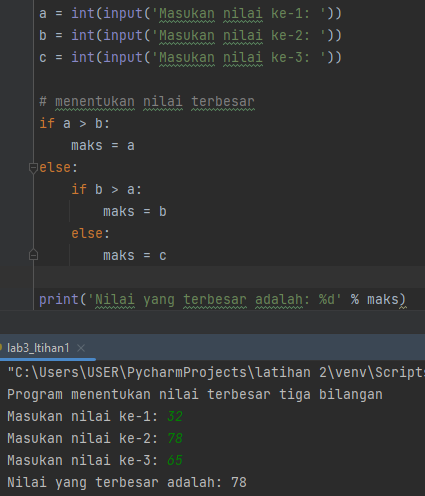
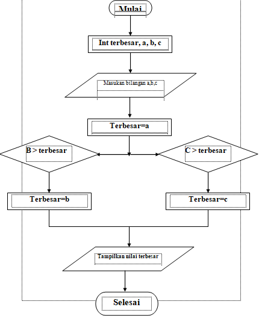

## Pertemuan 7 ,Labpy02
# Penjelasan Program
### 1.Menginput 3 bilangan
### 2.Setelah bilangan di input maka program akan membandingkan 3 bilangan tersebut
### 3.Perbandingan menggunakan statement IF

## Program 

## Flowchart 

